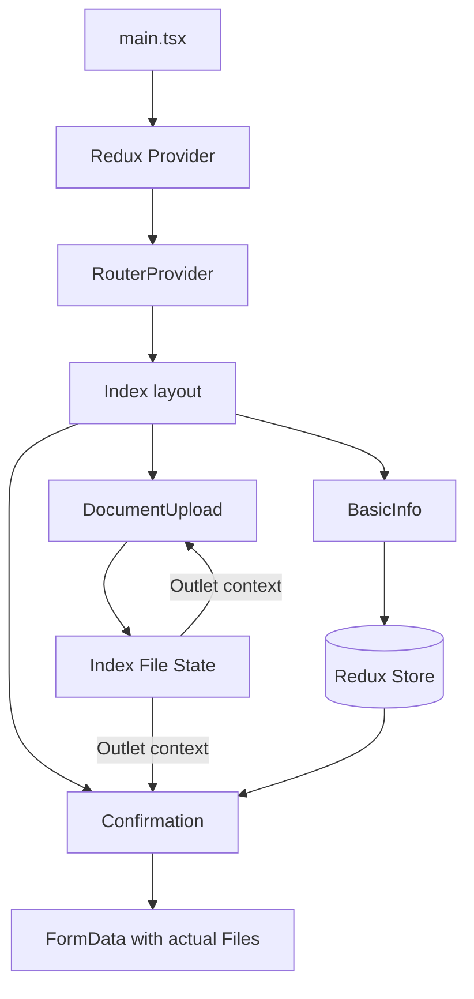

# React 19 KYC Form


使用 React 19 與 TypeScript 製作的多步驟 KYC（Know Your Customer）表單。專案包含基本資料驗證、文件上傳、跨步驟狀態保存、確認頁面與自動化測試。

[原始題目](https://github.com/user-attachments/files/19782764/Frontend.2nd.Interview.Assignment_.pdf)

## 使用技術

| 類別 | 技術 | 用途 |
| --- | --- | --- |
| UI | React 19 | Functional components 與表單畫面 |
| Language | TypeScript 5.7 | Props、表單資料與 Redux 型別 |
| Build Tool | Vite 6 | 開發伺服器與 production build |
| Routing | React Router 7 | 三步驟頁面與 nested routes |
| State | Redux Toolkit、React Redux | 保存可序列化的基本資料 |
| File State | React state、Outlet context | 保存實際 `File` 物件 |
| Testing | Vitest、Testing Library、jsdom | Component 與流程整合測試 |
| Quality | ESLint 9 | TypeScript 與 React Hooks 靜態檢查 |
| Package Manager | pnpm 10 | 依賴與 scripts 管理 |

## 功能說明

KYC 流程分為三個步驟：

1. **Basic Information**
   - 填寫姓名、Email、電話、國籍、地址與出生日期。
   - 按下 Next 時驗證必填欄位、Email 格式與年齡。
2. **Document Upload**
   - 上傳身分證正面與背面。
   - 可選擇多個附加證明文件。
   - 支援圖片預覽、檔案刪除、MIME type 與大小驗證。
3. **Confirmation**
   - 顯示基本資料與文件資訊。
   - Submit 時使用仍存在的實際 `File` 建立 `FormData`。
   - 成功流程會清除 Redux 與文件狀態。

### 主要共用元件

| 元件 | 說明 |
| --- | --- |
| `Alert` | 顯示 warning、info、success、danger 訊息 |
| `Button` | 提供 primary、secondary、success variants |
| `Input` | Controlled input，支援 required 與 Email 驗證 |
| `Select` | Controlled select，支援 required 驗證 |
| `DatePicker` | 日期欄位與可組合的 validation rules |
| `FileUpload` | 單檔上傳、驗證、預覽與刪除 |
| `MultiFileUpload` | 多檔上傳、個別驗證、預覽與刪除 |
| `StepIndicator` | 顯示 active、completed 與尚未完成的步驟 |

### Component 說明

以下列出各共用元件的用途與主要 props。表單類元件皆採 controlled component 模式，原生 HTML attributes 仍可透過 props 傳入。

#### Alert


顯示頁面層級提示訊息，支援 warning、info、success、danger 四種狀態。此元件最初由先前的 [Vue Alert component](https://github.com/nayuki0115/vue3-to-do-list/blob/main/src/components/Alert.vue) 改寫，用來練習 Vue 與 React component 設計的轉換。

| Prop | 型別 | 必填 | 說明 |
| --- | --- | :---: | --- |
| `visible` | `boolean` | ✓ | 控制 Alert 是否顯示 |
| `mode` | `'warning' \| 'info' \| 'success' \| 'danger'` | ✓ | Alert 顏色與語意 |
| `message` | `string` | ✓ | 顯示的提示內容 |
| `onClose` | `() => void` |  | 關閉按鈕 callback；未提供時不顯示關閉按鈕 |

#### Button


包裝原生 `<button>`，依 `variant` 套用流程按鈕樣式，同時保留原生 button attributes。

| Prop | 型別 | 必填 | 說明 |
| --- | --- | :---: | --- |
| `variant` | `'primary' \| 'secondary' \| 'success'` | ✓ | 對應 Next、Back、Submit 樣式 |
| `className` | `string` | ✓ | 額外的自訂 class |
| `children` | `ReactNode` | ✓ | 按鈕內容 |
| `onClick` | `MouseEventHandler` |  | 點擊事件 |
| 其他 props | `ButtonHTMLAttributes` |  | 支援 `type`、`disabled` 等原生屬性 |

#### Input


Controlled input。必填欄位會檢查空值；當 `type="email"` 時也會驗證 Email 格式。透過 forwarded ref 暴露 `validation()`，讓頁面在 Next 時統一觸發驗證。

| Prop | 型別 | 必填 | 說明 |
| --- | --- | :---: | --- |
| `label` | `string` | ✓ | 欄位標籤 |
| `id` | `string` | ✓ | 連結 label 與 input |
| `name` | `string` | ✓ | 表單欄位名稱 |
| `value` | `string` | ✓ | Controlled value |
| `required` | `boolean` |  | 是否為必填欄位 |
| `onChange` | `ChangeEventHandler` |  | 值改變時的 callback |
| `onBlur` | `FocusEventHandler` |  | 失去焦點時的 callback |
| 其他 props | `InputHTMLAttributes` |  | 支援 `type`、`placeholder` 等原生屬性 |

#### Select


Controlled select。元件不維護第二份 value，顯示內容與驗證都以父層傳入的 `value` 為準，並透過 forwarded ref 暴露 `validation()`。

| Prop | 型別 | 必填 | 說明 |
| --- | --- | :---: | --- |
| `label` | `string` | ✓ | 欄位標籤 |
| `id` | `string` | ✓ | 連結 label 與 select |
| `name` | `string` | ✓ | 表單欄位名稱 |
| `value` | `string` | ✓ | Controlled value |
| `options` | `SelectOption[]` | ✓ | `{ value, label }` 選項陣列 |
| `required` | `boolean` |  | 是否為必填欄位 |
| `onChange` | `ChangeEventHandler` |  | 選項改變時的 callback |
| `onBlur` | `FocusEventHandler` |  | 失去焦點時的 callback |

#### DatePicker


以原生 `input[type="date"]` 實作，可傳入多個 validation rules。規則依序執行，第一個回傳的錯誤訊息會顯示於欄位下方。

| Prop | 型別 | 必填 | 說明 |
| --- | --- | :---: | --- |
| `label` | `string` | ✓ | 日期欄位標籤 |
| `id` | `string` | ✓ | 連結 label 與 input |
| `name` | `string` | ✓ | 表單欄位名稱 |
| `value` | `string` |  | 日期字串 |
| `required` | `boolean` |  | 是否為必填欄位 |
| `onChange` | `(event) => void` |  | 日期改變時的 callback |
| `errorMessage` | `string` |  | 外部傳入的錯誤訊息 |
| `validationRules` | `ValidationRule[]` |  | 接收日期並回傳錯誤訊息或 `undefined` |
| `onValidationResult` | `(isValid, message?) => void` |  | 將驗證結果通知父層 |

#### FileUpload


單檔 controlled upload。檔案通過 MIME type 與大小驗證後才會交給父層；圖片可建立 object URL 預覽，切換或卸載時會釋放 URL。

| Prop | 型別 | 必填 | 說明 |
| --- | --- | :---: | --- |
| `label` | `string` | ✓ | 上傳欄位標籤 |
| `id` | `string` | ✓ | File input ID |
| `name` | `string` | ✓ | 表單欄位名稱 |
| `file` | `File \| null` | ✓ | 當前實際檔案 |
| `onFileChange` | `(file: File \| null) => void` | ✓ | 有效檔案或清除事件 callback |
| `accept` | `string` |  | 允許的 MIME types |
| `acceptText` | `string` |  | 顯示給使用者的格式說明 |
| `maxSizeMB` | `number` |  | 檔案大小上限 |
| `preview` | `boolean` |  | 是否顯示圖片預覽 |
| `required` | `boolean` |  | 是否為必填文件 |
| `errorMessage` | `string` |  | 頁面層級傳入的錯誤訊息 |

#### MultiFileUpload


多檔 controlled upload。每個檔案分別驗證，混合選取有效與無效檔案時，只會將有效檔案傳給父層，並保留無效檔案的錯誤訊息。

| Prop | 型別 | 必填 | 說明 |
| --- | --- | :---: | --- |
| `label` | `string` | ✓ | 上傳欄位標籤 |
| `id` | `string` | ✓ | File input ID |
| `name` | `string` | ✓ | 表單欄位名稱 |
| `files` | `File[]` | ✓ | 當前實際檔案陣列 |
| `onFileChange` | `(files: File[]) => void` | ✓ | 有效檔案陣列 callback |
| `accept` | `string` |  | 允許的 MIME types |
| `acceptText` | `string` |  | 顯示給使用者的格式說明 |
| `maxSizeMB` | `number` |  | 每個檔案的大小上限 |
| `preview` | `boolean` |  | 是否顯示圖片預覽 |
| `required` | `boolean` |  | 是否為必填文件 |
| `errorMessage` | `string` |  | 頁面層級傳入的錯誤訊息 |

#### StepIndicator


顯示目前流程進度：藍色代表 active、綠色代表 completed、灰色代表尚未完成。點擊步驟可切換頁面，但不會額外觸發驗證。

| Prop | 型別 | 必填 | 說明 |
| --- | --- | :---: | --- |
| `currentStep` | `number` | ✓ | 目前步驟，從 1 開始 |
| `totalSteps` | `string[]` | ✓ | 所有步驟名稱 |
| `onStepClick` | `(step: number) => void` |  | 點擊步驟時的 callback |

## 畫面相關說明

### 主要畫面


畫面由上而下包含：

- KYC 頁面標題
- Sticky step indicator
- 當前步驟的表單內容
- Back、Next 或 Submit 操作按鈕

### 驗證畫面


驗證失敗時會顯示紅色外框、欄位錯誤訊息與頁面層級 Alert。

## 技術需求

### 原始需求

- React 18 以上，使用 Functional Components。
- 使用 TypeScript 定義型別。
- 使用自製 UI components，不依賴 UI framework。
- 可使用狀態管理與表單驗證套件。

### 本機環境

- Node.js 22
- pnpm 10

## 安裝和運行說明

```bash
git clone <repository-url>
cd react19-kyc-form
pnpm install
pnpm run dev
```

Vite 預設會在 `http://localhost:5173` 啟動開發伺服器。

### 可用指令

| 指令 | 說明 |
| --- | --- |
| `pnpm run dev` | 啟動開發伺服器 |
| `pnpm run build` | 執行 TypeScript build 並產生 production assets |
| `pnpm run preview` | 預覽 production build |
| `pnpm run lint` | 執行全專案 ESLint |
| `pnpm run test` | 執行一次完整測試 |
| `pnpm run test:watch` | 以 watch mode 執行測試 |

## 專案結構

```text
react19-kyc-form/
├── public/                       # 靜態資源
├── src/
│   ├── components/               # 共用 UI 元件與 component tests
│   ├── hooks/                    # 跨步驟文件 context hook
│   ├── pages/                    # 流程頁面與 integration tests
│   ├── router/                   # React Router 設定
│   ├── store/                    # Redux store、slice 與 typed hooks
│   ├── test/                     # Vitest setup 與 test utilities
│   ├── types/                    # 明確 export/import 的 TypeScript 型別
│   ├── utils/                    # 共用檔案驗證
│   ├── App.tsx                   # RouterProvider
│   ├── index.css                 # 全域樣式
│   └── main.tsx                  # React application entry
├── index.html
├── package.json
├── pnpm-lock.yaml
├── tsconfig.json
└── vite.config.ts
```

## 架構設計



### 狀態管理

- **Redux Toolkit**
  - 只保存姓名、Email、電話、國籍、地址與出生日期等可序列化資料。
  - `RootState` 與 `AppDispatch` 直接由 store 推導。
  - Components 統一使用 `useAppSelector` 與 `useAppDispatch`。
- **Index layout state**
  - 保存身分證正反面與附加文件的實際 `File`。
  - 透過 React Router Outlet context 分享給 Upload 與 Confirmation。
  - 避免將非序列化的 `File` 放入 Redux，也不使用空檔案重建 metadata。

### 元件設計

- 表單元件採 controlled component 模式。
- `Input`、`Select` 與 `DatePicker` 透過共同的 `validation()` handle，在 Next 時統一觸發驗證。
- `FileUpload` 與 `MultiFileUpload` 共用 `validateUploadFile`，避免父子元件重複驗證。
- 所有 Props 與資料型別由 `src/types/formTypes.ts` 明確 export/import。

## Validation

### Basic Information

| 欄位 | 規則 |
| --- | --- |
| Name | 必填 |
| Email | 必填，且需符合 Email 格式 |
| Phone | 必填 |
| Nationality | 必填 |
| Address | 選填 |
| Date of Birth | 必填，年齡需介於 18–85 歲 |

### Document Upload

| 文件 | 必填 | 格式 | 大小限制 |
| --- | :---: | --- | --- |
| ID Card Front | ✓ | JPEG、PNG、PDF | 2 MB |
| ID Card Back | ✓ | JPEG、PNG、PDF | 2 MB |
| Additional Documents |  | JPEG、PNG、PDF | 每個檔案 10 MB |

驗證行為：

- 欄位在 change／blur 時更新自身錯誤狀態。
- Next 會驗證當前步驟的所有必填欄位。
- Back 不會阻擋使用者返回上一頁。
- Step indicator 允許切換步驟，不會額外觸發驗證。
- 無效檔案不會傳入父層狀態；多檔上傳只保留通過驗證的檔案。

## Testing Strategy

測試使用 Vitest、Testing Library、user-event、jest-dom 與 jsdom，從使用者可觀察行為驗證元件與完整流程。

| 測試檔案 | 涵蓋範圍 |
| --- | --- |
| `BasicInfo.test.tsx` | 必填欄位、Email、年齡、Redux 保存與 Next navigation |
| `FileUpload.test.tsx` | 合法檔案、MIME type、檔案大小與父層 callback |
| `KycFlow.test.tsx` | Back／Next File 保存、Confirmation、FormData 與 Submit/reset |

目前基準：

```text
Test Files  3 passed
Tests       8 passed
```

建議在提交前執行：

```bash
pnpm run lint
pnpm run test
pnpm run build
```

## 目前限制

- 專案目前沒有設定後端 API endpoint；Submit 會建立包含真實 `File` 的 `FormData` 並執行前端成功/reset 流程。
- 實際 `File` 只保存在目前瀏覽器頁面的記憶體中。Back／Next 可以保存，但重新整理頁面後會清除。
- Step indicator 允許直接前往其他步驟，目前沒有 route guard。
